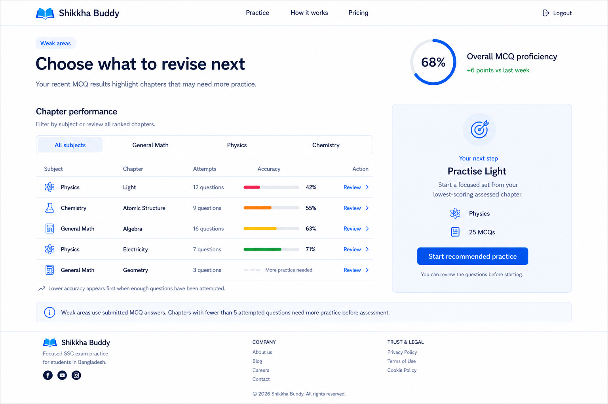

# Weak Areas dashboard

## Feature purpose

`/dashboard/weak-areas` is an authenticated revision-guidance page based on submitted MCQ answers. It helps a student identify assessed chapters that may benefit from more practice and offers one backend-generated next practice session. It is not an exam-result prediction, a diagnosis of why an answer was incorrect, or a guarantee of improvement.

The page replaces the former generic `Coming Soon` state and uses the existing progress-dashboard endpoint. Production values are always returned by the backend; the screenshot values below are visual reference data only.

## Approved screenshot



The screenshot defines the calm white/light-blue visual direction, two-column desktop composition, score-ring treatment, subject filters, chapter list density, recommendation emphasis, and restrained use of status colour.

## Implementation sources

Frontend:

- Route wrapper: `app/dashboard/weak-areas/page.tsx`
- Page UI and state handling: `components/weak-areas-content.tsx`
- Frontend response types: `lib/api/types.ts`
- API function: `lib/api/index.ts`
- SWR hook: `lib/api/hooks.ts`
- Existing practice-session item loading and recovery: `lib/api/practice-hooks.ts` and `components/practice-session-content.tsx`
- Auth-scoped cache cleanup: `lib/auth-context.tsx`
- Page tests: `components/weak-areas-content.test.tsx`
- API contract test: `lib/api/index.test.ts`
- Logout cache test: `lib/auth-context.test.tsx`

Backend sources of truth, inspected read-only:

- Route and authentication: `C:\Projects\ai_study_backend\src\routes\progress.routes.js`
- Response envelope: `C:\Projects\ai_study_backend\src\controllers\progressController.js`
- Proficiency, ranking, low-data, trend, and recommendation logic: `C:\Projects\ai_study_backend\src\services\progressService.js`

The endpoint is not currently described in `C:\Projects\ai_study_docs\CONTRACTS\api.md` or represented by a schema in `C:\Projects\ai_study_docs\CONTRACTS\schemas\`.

## Existing API contract

### Request

`GET /api/profile/progress-dashboard`

- Requires the existing authentication token.
- Accepts no request body and no query parameters.
- The frontend calls `/profile/progress-dashboard` because the shared API client already prefixes requests with `/api`.
- The controller returns the existing `{ success: true, data: ... }` envelope; the shared frontend client unwraps `data`.

### Implemented response data

```ts
interface ProgressDashboardResponse {
  message: string | null
  proficiency: null | {
    score: number
    trend_vs_last_week: number | null
  }
  weakness_ranking: Array<{
    subject_id: number
    subject_name: string
    chapter_id: number
    chapter_name: string
    accuracy: number
    questions_attempted: number
    message: string | null
  }>
  recommendation: null | {
    label: string
    generate_payload: PracticeGenerateRequest
  }
}
```

No other progress-dashboard fields are assumed by the frontend.

### Implemented backend semantics

- Weak-area data is calculated from submitted MCQ answers.
- `proficiency.score` is the overall submitted-MCQ accuracy percentage.
- `trend_vs_last_week` compares the current seven-day MCQ accuracy with the preceding seven-day period. It is `null` when either comparison window has no attempts.
- Chapter rows are ordered by ascending accuracy, then ascending attempt count, then chapter name.
- Five attempts are currently required before a chapter is judged confidently.
- A chapter with fewer than five attempts may remain in `weakness_ranking`, but its row includes `message: "Need more practice to judge this area"`.
- `recommendation` currently supplies a label and a generation payload for 25 MCQs, using up to the first two ranked chapters from the weakest subject.
- `exam_type_id` is intentionally removed from individual ranking rows. It remains available only inside the supplied recommendation generation payload.

## Final page hierarchy

The page continues to use the shared `PageShell`, authenticated navbar, and approved footer.

1. Shared authenticated navigation
2. `Weak areas` eyebrow, page heading, and supporting text
3. Overall MCQ proficiency ring and weekly comparison
4. Recommended-practice panel
5. Chapter-performance heading and subject filters
6. Ranked chapter list
7. Ranking explanation
8. Assessment/low-data explanation
9. Shared footer

On desktop, chapter performance occupies the wider left column and the recommendation occupies the right column. The recommendation is earlier in the DOM so the required mobile and screen-reader order does not depend only on CSS reordering.

## Frontend components and data flow

`app/dashboard/weak-areas/page.tsx` keeps the route wrapper small and renders `WeakAreasContent` inside `PageShell`.

`WeakAreasContent`:

- waits for the existing auth context before enabling the dashboard request;
- calls `useProgressDashboard()` once for the page data;
- limits visible subject analytics to General Math, Physics, and Chemistry;
- treats the backend/catalog name `Mathematics` as the existing General Math product category and always displays the canonical `General Math` label;
- filters the returned ranking without re-requesting or reordering it;
- renders all page states;
- calls the existing `generatePractice()` function only for the backend recommendation;
- routes row-level actions to the existing subject configuration path;
- clears generation errors and restores the CTA after a failed request.

`useProgressDashboard()` uses the SWR key `['progress-dashboard']`, disables focus revalidation, and exposes SWR's real `mutate()` function for Retry. Logout clears this auth-scoped cache with the other protected data caches.

The existing practice-item endpoint is paginated. `getPracticeItems()` requests 20 items per page, loads every returned page, removes duplicate `practice_item_id` values, orders the combined items by section/order number, and continues to return one `PracticeItem[]` to the existing session UI. A legacy array response remains supported. If any required page fails, the practice session shows an explicit Retry state instead of silently presenting an incomplete question set.

## Responsive behaviour

Desktop:

- Constrained, spacious content width rather than a full-width dense dashboard.
- Introduction and proficiency summary share the top row.
- Chapter list and recommendation use the approved wide-left/narrow-right composition.
- Chapter data uses aligned column headings and compact rows.

Tablet:

- Spacing reduces while controls retain approximately 44-pixel targets.
- The recommendation can stack before the chapter section when the side-by-side layout would be cramped.
- Filters remain a four-option grid when space permits.

Mobile:

- Required order: introduction, proficiency, recommendation, filters, chapter entries, assessment explanation, footer.
- Filters use two columns rather than horizontal scrolling.
- The desktop list becomes stacked chapter summaries; each entry keeps subject, chapter, attempts, accuracy or low-data message, and the `Practise` action together.
- No horizontal table scroll is required.

The implementation was reviewed at 1440x900, 1280x800, 768x1024, 390x844, 360x800, and 390x667. Populated-state verification used a disposable frontend QA API process outside both repositories; it changed no backend code or database data and was removed after testing.

## Subject-filter behaviour

- The supported filters are fixed to `All subjects`, `General Math`, `Physics`, and `Chemistry`.
- Both backend `General Math` and current catalog `Mathematics` values map to the General Math filter and canonical display label.
- Filtering is client-side and preserves backend order.
- Switching filters does not trigger another API request.
- Unsupported subject rows are not displayed.
- A backend recommendation is shown only when its `subject_id` matches a supported returned ranking row.
- An empty selected subject shows a subject-specific explanation and a `Show all subjects` recovery action.
- The filters use automatic-activation tabs: Arrow keys move between adjacent tabs, and Home/End move to the first/last tab.

## Accuracy, attempts, and low-data semantics

- Assessed rows show a visible percentage and an accessible progress bar.
- Progress width and displayed/announced percentages are clamped to 0-100 defensively.
- Attempt counts are displayed as non-negative whole numbers with singular/plural wording.
- Colour is not the only signal: the numeric percentage remains visible and announced.
- A row with a backend `message` is treated as low-data. It shows `More practice needed` and the backend message instead of presenting the percentage as a confident diagnosis.
- The frontend does not recalculate ranking accuracy or decide its own five-attempt threshold for individual rows; it explains the backend rule and respects the row message.

## Proficiency and trend handling

- The score ring displays `proficiency.score` and clamps unexpected display values to 0-100.
- A positive trend is displayed with a signed numeric label and restrained green text.
- A negative trend retains its signed numeric label without punitive wording.
- A zero trend displays `No change vs last week`.
- A `null` or non-finite trend displays `Not enough recent data to compare yet.` It is never converted to `0 points`.
- Trend meaning is always provided in text, not colour alone.

## Page states

Loading:

- Layout-matched skeletons reserve the introduction, proficiency, list, and recommendation shapes.
- The container has `role="status"`, an accessible name, and screen-reader loading text.

No submitted MCQ data:

- Triggered when `proficiency` is `null`, the supported ranking is empty, and no supported recommendation is available.
- Shows `Your weak areas will appear here`, explains that a submitted MCQ session is needed, and links to `/subjects` with `Choose a subject`.

Recommendation unavailable:

- Keeps the ranking usable.
- Replaces the recommendation card with a quiet `Choose your next practice` panel and a valid `/subjects` action.
- Does not show an empty or disabled fake recommendation.

API error:

- Shows calm recovery copy without raw server details.
- `Retry` calls the hook's actual SWR revalidation function.

Unauthenticated or expired authentication:

- Uses the existing auth context and `ApiClientError` status handling.
- Redirects to `/login?next=%2Fdashboard%2Fweak-areas` so the intended destination is preserved.
- Does not introduce a second authentication mechanism.

## Recommended-practice flow

The dominant CTA uses the backend recommendation rather than reconstructing data from the visible row.

1. Ignore activation if there is no supported recommendation or a request is already active.
2. Disable the CTA and display `Starting practice...`.
3. Pass `recommendation.generate_payload` unchanged to the existing `generatePractice()` function.
4. Keep the existing request validation and response handling inside `generatePractice()`.
5. Navigate to `/practice/{practice_session_id}` using the returned ID.
6. Preserve an existing backend warning as the encoded `warning` query parameter.
7. On failure, show an accessible inline alert and re-enable the CTA.

After navigation, the existing practice-items endpoint may return multiple pages. The frontend loads the complete section before enabling the practice experience, so a 25-MCQ recommendation exposes questions 1-25 and reports progress against all 25. A later-page failure produces `Unable to load practice questions` with `Retry loading questions`.

Non-recommended chapter actions use `Practise` and link to `/subjects/{subject_id}`. They do not generate a session because a ranking row lacks the complete generation contract, including `exam_type_id`.

## Accessibility decisions

- One page-level `h1` and logical section headings.
- Existing navigation, main, complementary, and footer landmarks are preserved.
- Semantic `tablist`, `tab`, and `tabpanel` roles with `aria-selected`, `aria-controls`, `aria-labelledby`, roving `tabIndex`, and keyboard activation.
- Visible focus rings and approximately 44-pixel filter/CTA/row-action targets.
- Progress bars include accessible names, minimum, maximum, and current values.
- Low-data, trends, errors, and loading states are communicated in text.
- Recommendation errors use `role="alert"`; loading uses a polite status pattern.
- Mobile DOM order places the recommendation before filters and chapter content.
- Filter transitions opt out under reduced-motion preferences.
- Mobile content stacks without using horizontal table scrolling as the primary solution.

## Tests

`components/weak-areas-content.test.tsx` contains 19 focused tests covering:

- contract-backed subject/chapter names, attempts, accuracy, and trends;
- supported-subject filtering and exclusion of unsupported subjects/CQ/Mixed analytics;
- mouse filtering, Arrow/Home/End keyboard activation, and selected state;
- subject-filter empty recovery;
- low-data semantics;
- positive, negative, zero, null, and malformed trend/display values;
- no-data, loading, recommendation-null, API-error/Retry, and 401 states;
- recommendation placement in screen-reader order;
- safe row-level `Practise` links;
- exact recommendation payload use;
- duplicate-submit prevention;
- successful session navigation and warning preservation;
- generation failure announcement and CTA recovery.

Additional coverage:

- `lib/api/index.test.ts` verifies the exact authenticated endpoint call, unwrapped contract result, complete 25-item pagination, legacy array compatibility, deduplication/ordering, and later-page failure propagation.
- `lib/auth-context.test.tsx` verifies logout clears the progress-dashboard SWR cache.
- `components/practice-session-content.test.tsx` verifies all 25 questions are exposed, an answer survives navigation across the former page boundary, and incomplete item loads have a recoverable error state.
- Existing practice configuration tests confirm the reused practice-generation path remains functional.

## Verification results

Final verification on 2026-07-13:

- `npm run lint`: passed.
- `npx tsc --noEmit --incremental false`: passed.
- `npm test`: passed, 22 test files and 116 tests.
- `npm run build`: passed; `/dashboard/weak-areas` included in the production route output.
- `git diff --check`: passed.
- Shared FAQ, About, How It Works, and Subjects pages were spot-checked without horizontal overflow.
- Populated desktop/tablet/mobile checks at 1440x900, 1280x800, 768x1024, 390x844, and 360x800 had no horizontal overflow; mobile chapter entries used one-column summaries and two-column filters.
- Live `Mathematics` rows appeared under and displayed as `General Math`; the raw catalog name was not exposed in the dashboard UI.
- Desktop `Practise` actions rendered at 44 pixels high.
- The recommendation sent its supplied payload once, navigated to the returned session, fetched item pages 1 and 2 at 20 items per page, displayed `0 of 25 answered`, exposed question 25, and preserved an answer while navigating from question 1 to question 21 and back.
- No Weak Areas console error, React warning, hydration warning, invalid nesting, duplicate-ID warning, or missing-key warning was found during populated QA.

## Intentional screenshot deviations

- Screenshot subjects, chapters, attempts, scores, percentages, trends, and recommendation wording are not hardcoded; live values come from the endpoint.
- The current shared navbar and footer are preserved rather than duplicated to match screenshot-only details.
- Shared footer links reflect real routes; Refund Policy, Blog, and Careers are not added.
- Row actions use the approved `Practise` wording instead of screenshot `Review` wording.
- Low-attempt rows show the backend message and `More practice needed` rather than a confident accuracy diagnosis.
- The recommendation heading renders the backend label rather than reconstructing a shorter title.
- Progress bars use the restrained primary palette and visible text rather than red/amber/green classifications.
- Mobile entries are stacked summaries instead of a horizontally scrolling desktop table.

## Remaining limitations

- The in-app QA browser did not apply its browser-zoom shortcut, so actual 200% browser zoom remains a manual follow-up. Reflow was verified at a 640-pixel effective viewport (equivalent to a 1280-pixel viewport at 200% layout width) with no horizontal overflow, but this does not replace a real browser-zoom check.
- Full native Tab traversal could not be driven by the in-app QA browser. Filter focus, Arrow/Home/End activation, selected-state announcement, focus styling, and full keyboard paths remain covered by component tests; a final manual native-Tab pass is still appropriate.
- Arbitrary ranking rows cannot directly generate practice because they do not include `exam_type_id` or a complete generation payload. They intentionally route through the existing subject configuration screen.
- Central API documentation does not yet list the implemented progress-dashboard endpoint.
- Consistent endpoint mounting/exposure in deployed environments was not verified in this frontend task.
- A pre-existing development-only shared-logo LCP warning and Vitest `--localstorage-file` warnings remain outside the Weak Areas scope.

## Tawsif handoff — progress-dashboard integration

### 1. What already exists

The backend already provides:

- authenticated `GET /api/profile/progress-dashboard`;
- submitted-MCQ proficiency calculation;
- week-over-week comparison with `null` when comparison data is insufficient;
- chapter weakness ranking;
- the low-data message for chapters below five attempts;
- a recommended 25-MCQ `generate_payload` compatible with existing practice generation.

### 2. What the frontend completed

The frontend now provides:

- exact TypeScript interfaces for proficiency, ranking rows, recommendation, and the full response;
- an authenticated API client function using the existing response-envelope handling;
- a focused SWR hook and logout cache cleanup;
- populated, loading, no-data, low-data, null-trend, null-recommendation, filter-empty, API-error/Retry, and unauthenticated states;
- client-side filtering for General Math, Physics, and Chemistry without re-fetching or reordering;
- frontend-only normalization of backend `Mathematics` rows into the General Math filter and display label;
- exact recommendation-payload generation, duplicate-submit prevention, warning preservation, and returned-session navigation;
- complete loading of all pages in an existing 25-question practice session, with Retry instead of partial presentation;
- responsive desktop/tablet/mobile presentation and accessible tab, progress, loading, and error semantics;
- focused API, UI, interaction, and cache regression tests.

### 3. Important contract limitation

Ranking rows do not contain `exam_type_id`, while direct practice generation requires it. The frontend must therefore:

- use the supplied recommendation payload for the dominant CTA;
- route other chapter actions through an existing valid subject/practice configuration path;
- never invent `exam_type_id` or silently fall back to General practice.

The current frontend follows that rule by passing `recommendation.generate_payload` directly and routing row actions to `/subjects/{subject_id}`.

### 4. Questions or future decisions for Tawsif

These are future decisions, not current implementation requirements:

- Should arbitrary ranked chapters eventually receive a complete generation payload, or should row actions continue through subject configuration?
- Should this implemented endpoint and its response shape be added to `C:\Projects\ai_study_docs\CONTRACTS\api.md` and the central schema/examples?
- Do all deployed environments mount and expose `/api/profile/progress-dashboard` consistently?
- Does deployed 401 behavior match the project-wide `{ success: false, error }` authentication contract used by the frontend?
- Should low-data chapters remain mixed into `weakness_ranking`, or should a future contract separate assessed and insufficient-data chapters?
- Should the backend and central documentation eventually standardize `Mathematics` versus the product label `General Math`? The frontend currently accepts both without changing the response contract.
- Should the existing paginated practice-items response be documented centrally? The frontend now consumes its implemented `page`, `page_size`, `total_in_section`, and `items` fields without requesting a backend change.

No exact new field or endpoint is prescribed here; any contract revision remains a backend/product decision.

### 5. Explicit change declaration

- Backend code changes: **No**.
- API response changes: **No**.
- Database changes: **No**.
- Authentication changes: **No**. Existing login/token/401 behavior is unchanged; logout cache cleanup now includes progress-dashboard data.
- Payment/subscription changes: **No**.
- Practice-generation changes: **No**. The existing function, payload, and route are reused; frontend item retrieval now consumes all pages from the existing practice-items response.
- Environment changes: **No**.
- Package changes: **No**.

The backend worktree already contained an unrelated modified `package-lock.json`; it was preserved and is not part of this frontend implementation.
